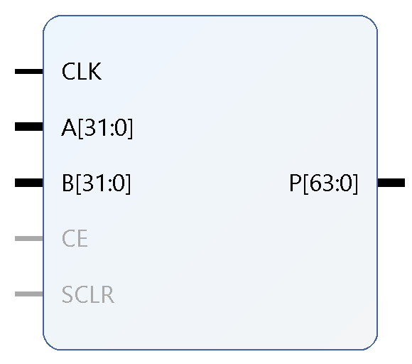
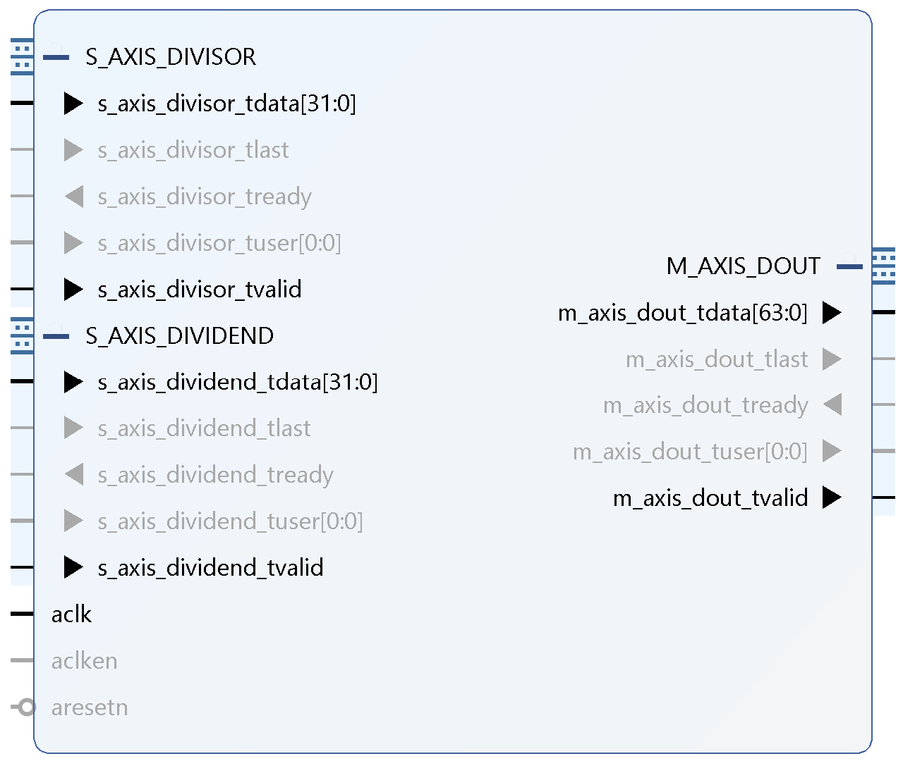
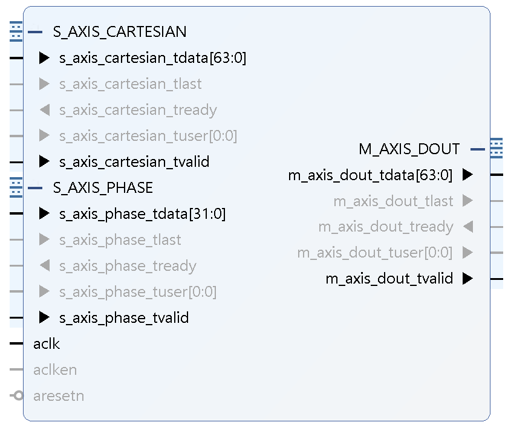

# Squishy Car

## Usage:

### Build (Locally)

vivado -mode batch -source build.tcl

### Flashing to FPGA

openFPGALoader -b arty_s7_50 obj/final.bit

### Simulating testbenches

To run the testbenches, we will need to first simulate the divider IP:

In `angle.sv`, replace `signed_int_divider`  with `signed_int_divider_sim`.

Then paste any of the following lines into the command line.

#### Check in Polygon

iverilog -g2012 -o foo.out sim/in_polygon_tb.sv hdl/in_polygon.sv hdl/angle.sv hdl/signed_int_divider_sim.sv

#### Manage Environment

iverilog -g2012 -o foo.out sim/manage_env_tb.sv hdl/manage_environment.sv hdl/xilinx_true_dual_port_read_first_2_clock_ram.v

#### Obstacles on Screen

iverilog -g2012 -o foo.out sim/on_screen_tb.sv hdl/get_obstacles_on_screen.sv

## IP

### Multiplier

multiply_18_bit: uses 1 DSP and has latency of 3 clock cycles

### Divider

The higher 32 bits of the output (i.e., [63:32]) is the quotient, and the lower 32 bits (i.e., [31:0]) is the remainder.

This module always has a latency of 36 clock cycles.

### Rotate

The higher 32 bits of the input and output (i.e., [63:32]) is the y-axis, and the lower 32 bits (i.e., [31:0]) is the x-axis.

This module also has a latency of 36 clock cycles.

### TODOS

multiplier with DSPs